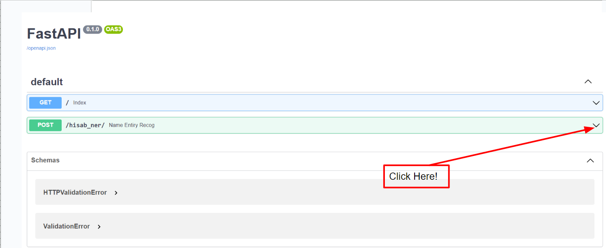

# Welcome to Hisab Name Entity Recogniton API

Simple api to load name entiry recognition pretrain model and apply prediction steps to infer the ner result.

This api uses the great FastAPI and other few python packages!

## Usage

Open up the cmd in `hisab_ner_api/src/` folder then run below cmd.

```bash
$> uvicorn application::app
```

Now you can access [http://localhost:8787](http://localhost::8000/docs) to see a simple response.

Since this is build using FastAPI, you can interact with the api using their built in interface, just go to [http://localhost::8000/docs/](http://localhost::8000/docs/).  <br/>
And follow the below images instructions.  <br/>

  <br/>
  <br/>
  <br/>
